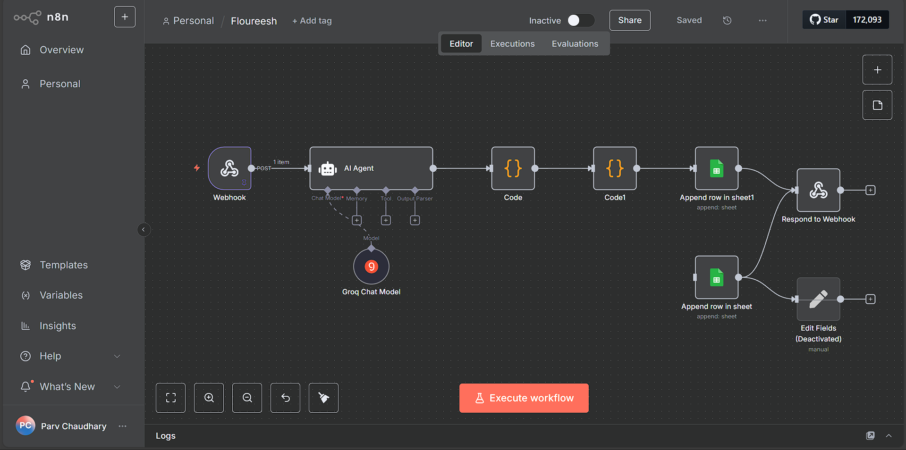

# System Architecture

This document explains the internal architecture of the WhatsApp Order Automation system, including component responsibilities, data flow, and design decisions.

---

## High Level Overview

The system is designed as an event driven automation pipeline.

Orders are received as WhatsApp messages filled with errors and unstructured formatting and converted into structured, priced order records stored in Excel.

---

## Architecture Diagram

*(Diagram represents the n8n workflow and message flow across components.)*

---

## Core Components

### 1. WhatsApp Bridge (Node.js)

**Technology:**  
- Node.js  
- whatsapp-web.js  

**Responsibilities:**
- Connects to WhatsApp Web via QR authentication
- Listens only to approved phone numbers or groups
- Forwards incoming messages to n8n via webhook
- Waits for confirmation before reacting with "👍"

**Key Design Choice:**
- Uses webhook based communication instead of direct DB writes to keep WhatsApp logic isolated from business logic.

---

### 2. n8n Workflow Engine

**Role:** n8n acts as the automation brain of the system.

**Responsibilities:**
- Receives webhook events from WhatsApp bridge
- Controls execution order
- Handles retries and failures
- Coordinates AI parsing, pricing, and storage

This allows the system to remain modular and easily extensible.

---

### 3. AI Agent (LLM Parsing Layer)

**Model Used:**  
- Groq hosted LLM (or local Ollama alternative)

**Purpose:**
- Converts unstructured WhatsApp messages into structured JSON

**Why AI is used:**
Human style text parsing is required due to inconsistent message formats.

AI is not used for calculations or pricing.

---

### 4. Output Parser

AI responses are returned as plain text.

A custom output parser:
- Removes extra text or markdown
- Extracts valid JSON
- Validates structure before execution continues

This acts as a safety boundary between AI output and business logic.

---

### 5. Pricing Engine

Implemented using deterministic logic.

**Responsibilities:**
- Normalize units (kg / gm)
- Convert quantities to standard units
- Apply fixed price rules
- Calculate final order total

No pricing decisions are handled by AI.

---

### 6. Data Storage (Excel / Google Sheets)

Acts as the system’s persistent storage.

Stores:
- Customer details
- Item quantities
- Calculated totals
- Order metadata

An append only approach ensures traceability.

---

### 7. Webhook Response Handler

After successful Excel insertion:
- n8n responds with `{ "status": "success" }`

Only then does the WhatsApp bot send confirmation.

This ensures no false acknowledgments.

---

## Architectural Principles

### Separation of Concerns
Each component has a single responsibility:
- WhatsApp ingestion
- Workflow orchestration
- AI interpretation
- Pricing computation
- Data persistence

---

### AI as Interpreter Only
AI is limited strictly to text understanding.

All calculations and decisions are deterministic.

---

### Fail Safe Confirmation
User confirmation is sent only after successful data persistence.

This prevents silent data loss.

---

### Extensibility
The architecture supports future extensions:
- Invoice generation
- Inventory management
- Analytics dashboards
- Migration to official WhatsApp Cloud API

---

## Summary

This architecture demonstrates:
- Event driven system design
- Safe AI integration
- Modular automation
- Real world reliability considerations

The system prioritizes correctness, clarity, and maintainability over complexity.